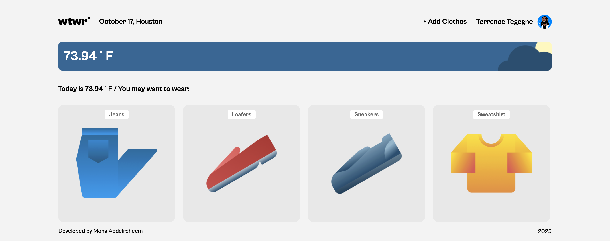

# 👕 Weather Wardrobe React App

A simple React app that suggests what to wear based on the current weather.  
It uses real-time data from the OpenWeather API and changes visuals for day and night. 🌤️🌙  

---

### 🌐 Live Demo  
You can see and try the app here 👉 [Weather Wardrobe Live](https://monaabdelreheem.github.io/se_project_react/)  

📦 You can also view the full project repository on GitHub:  
[Weather Wardrobe Repository](https://github.com/Monaabdelreheem/se_project_react)

🔗 Backend Repository:  
[WTWR Backend API](https://github.com/Monaabdelreheem/se_project_express)

---

## ⚙️ Built With  
- React + Vite  
- OpenWeather API  
- CSS (BEM style)  
- GitHub Pages for deployment  

---

## 🗄️ Local Backend (JSON Server)

This project uses a local JSON server to store and manage clothing items.

Running the backend:

```bash 
json-server --watch db.json --id _id --port 3001
```

---

## ✨ Features  
- User authentication (register, login, logout)
- JWT token-based authorization
- Protected routes for authenticated users
- Dynamic weather updates  
- Day/night background changes  
- Add new garments through a modal form 
- Card delete functionality with confirmation modal
- Like/unlike cards (persists between reloads)
- Edit user profile (name and avatar)
- Item preview modal with "Delete item" button  
- Weather-filtered clothing sections  
- Profile page with user's personal wardrobe  
- API integration with Express backend
- Form validation with error handling

---

## 🧠 What I Learned  
- Fetching and filtering live API data  
- Managing React state and effects  
- Deploying with gh-pages  
- json-server --watch db.json --id _id --port 3001
- npm run dev

---

## 📸 Screenshots  

Here’s a quick look at the project in action:  

### Home Page  
  

### Add Garment Modal  
  

### Weather Card  
  

---

## 💬 Author  

**Mona Abdelreheem**  
[GitHub](https://github.com/Monaabdelreheem) • [LinkedIn](https://www.linkedin.com/in/mona-abdelreheem/)
