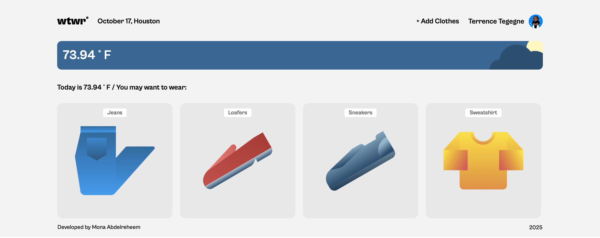
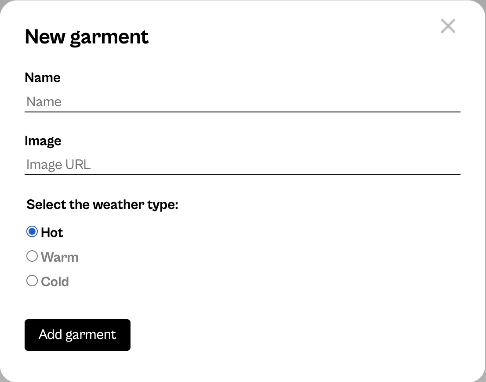

# WTWR (What to Wear React)

**Live Website:**  
https://mona-wtwr.artitech.com/

**Backend API:**  
https://api.mona-wtwr.artitech.com/

---

## Deployment

- Frontend: https://mona-wtwr.artitech.com/
- Frontend (www): https://www.mona-wtwr.artitech.com/
- Backend API: https://api.mona-wtwr.artitech.com/
- Frontend repo: https://github.com/Monaabdelreheem/se_project_react
- Backend repo: https://github.com/Monaabdelreheem/se_project_express
- Project pitch video: https://drive.google.com/file/d/1X0Jr1Tb7wt5OXSugp5YywhJzyz6p2m4d/view?usp=drive_link

---

## Project Pitch Video
Check out [this video](https://drive.google.com/file/d/1X0Jr1Tb7wt5OXSugp5YywhJzyz6p2m4d/view?usp=drive_link)


## ⚙️ Built With  
- React + Vite  
- OpenWeather API  
- CSS (BEM style)  
- GitHub Pages for deployment  

---

## 🗄️ Local Backend (JSON Server)

This project uses a local JSON server to store and manage clothing items.

Running the backend:

```bash 
json-server --watch db.json --id _id --port 3001
```

---

## ✨ Features  
- User authentication (register, login, logout)
- JWT token-based authorization
- Protected routes for authenticated users
- Dynamic weather updates  
- Day/night background changes  
- Add new garments through a modal form 
- Card delete functionality with confirmation modal
- Like/unlike cards (persists between reloads)
- Edit user profile (name and avatar)
- Item preview modal with "Delete item" button  
- Weather-filtered clothing sections  
- Profile page with user's personal wardrobe  
- API integration with Express backend
- Form validation with error handling

---

## 🧠 What I Learned  
- Fetching and filtering live API data  
- Managing React state and effects  
- Deploying with gh-pages  
- json-server --watch db.json --id _id --port 3001
- npm run dev

---

## 📸 Screenshots  

Here’s a quick look at the project in action:  

### Home Page  
  

### Add Garment Modal  
  

### Weather Card  
  

---

## 💬 Author  

**Mona Abdelreheem**  
[GitHub](https://github.com/Monaabdelreheem) • [LinkedIn](https://www.linkedin.com/in/mona-abdelreheem/)
