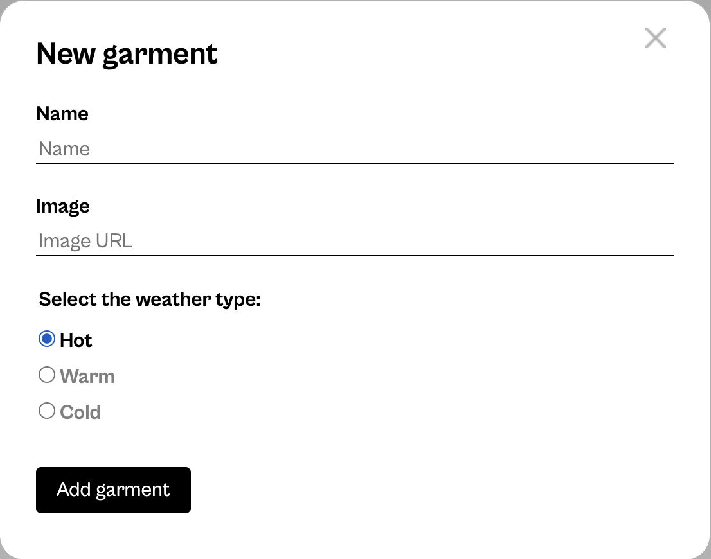
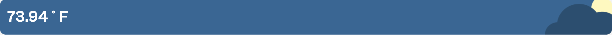

# 👕 Weather Wardrobe React App

A simple React app that suggests what to wear based on the current weather.  
It uses real-time data from the OpenWeather API and changes visuals for day and night. 🌤️🌙  

---

### 🌐 Live Demo  
You can see and try the app here 👉 [Weather Wardrobe Live](https://monaabdelreheem.github.io/se_project_react/)  

📦 You can also view the full project repository on GitHub:  
[Weather Wardrobe Repository](https://github.com/Monaabdelreheem/se_project_react)

---

## ⚙️ Built With  
- React + Vite  
- OpenWeather API  
- CSS (BEM style)  
- GitHub Pages for deployment  

---

## ✨ Features  
- Dynamic weather updates  
- Day/night background changes  
- Add new garments through a modal form  

---

## 🧠 What I Learned  
- Fetching and filtering live API data  
- Managing React state and effects  
- Deploying with gh-pages  

---

## 📸 Screenshots  

Here’s a quick look at the project in action:  

### Home Page  
  

### Add Garment Modal  
  

### Weather Card  
  

---

## 💬 Author  

**Mona Abdelreheem**  
[GitHub](https://github.com/Monaabdelreheem) • [LinkedIn](https://www.linkedin.com/in/mona-abdelreheem/)
